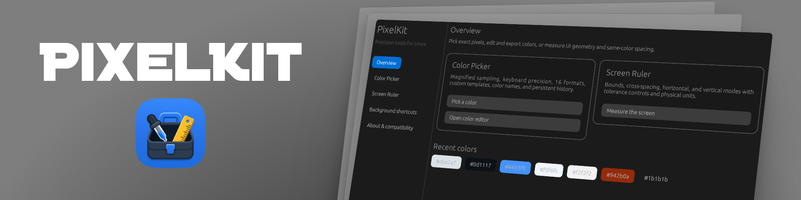

# PixelKit

PixelKit is a native Linux implementation of the Microsoft PowerToys **Color
Picker** and **Screen Ruler** workflows. It is written in Rust, ships as one
small process-on-demand binary, stores everything locally, and supports both
X11 and Wayland without privileged input or capture hooks.

> PixelKit is independent of Microsoft and PowerToys. PowerToys was used as the
> MIT-licensed behavioral reference included beside this project.

## See PixelKit in action

https://github.com/user-attachments/assets/fd06e8b0-96c1-4ea9-b514-56c151987239

## Features

### Color Picker, Magnifier, and editor

- Pick any captured pixel with an always-on-top full-screen overlay.
- 13×13 magnifier with five wheel-controlled zoom levels.
- Standalone magnifier with centered-grid and tooltip styles plus
  configurable starting/maximum zoom, grid size, cursor, Wayland capture
  behavior, and global shortcut.
- Arrow-key movement at one pixel; Shift+arrow movement at ten pixels.
- Primary, middle, and secondary click actions: pick then edit, pick and close,
  or close without copying.
- Enter/Space to pick and Escape/Backspace to cancel; Escape also closes the
  editor opened after a pick.
- Full-resolution, losslessly tiled capture rendering on displays larger than
  the GPU's single-texture limit.
- Persistent, de-duplicated history with configurable limit.
- Editable RGB and HSV controls, three/six-digit HEX input, and four related
  color variations.
- Nearest human-readable color names using the PowerToys bucket algorithm.
- Export history as JSON or text, grouped by color or by format.
- Sixteen built-in representations: HEX, RGB, HSL, HSV, CMYK, HSB, HSI, HWB,
  NCol, CIE XYZ, CIE LAB, Oklab, Oklch, VEC4, Decimal, and HEX Int.
- PowerToys-compatible custom format tokens such as `%ReX`, `%Gr`, `%Hu`,
  `%Sl`, `%Na`, and the full CIE/Oklab parameter set.

### Screen Ruler

- Bounds/rectangle measurement.
- Cross, horizontal, and vertical same-color spacing measurement.
- Sum-of-RGB or per-channel edge tolerance, directly typeable from 0–255 and
  adjustable by mouse wheel in 15-point steps.
- Configurable crosshair color and end caps.
- Pixels, inches, centimetres, and millimetres, using X11 physical display data
  or a configurable Wayland fallback DPI.
- Shift-click retains multiple measurements; clipboard output contains every
  retained measurement.
- Touch/pointer input, right-click cancellation, Ctrl+1…4 tool selection, and
  non-blocking snapshot recapture.
- X11 continuous capture uses a transparent blank/capture cycle so PixelKit's
  own lines are excluded from the sampled image.

### Linux integration

- Direct, low-latency X11 root capture and native key grabs.
- `xdg-desktop-portal` Screenshot and GlobalShortcuts interfaces on Wayland and
  inside Flatpak.
- A lightweight background mode that does no screen polling while idle.
- Desktop actions, AppStream metadata, scalable and high-resolution icons, man
  page, and systemd user unit.
- No telemetry, cloud service, network request, root helper, or setuid binary.

The Fedora 44 x86_64 reference build is a 9.2 MB stripped executable. The X11
shortcut daemon settles at roughly 5.6 MB RSS and blocks on events while idle;
it does not initialize the GUI or capture a screen until a tool is launched.

## X11 and Wayland behavior

| Capability | X11 | Wayland / Flatpak |
|---|---|---|
| Screen capture | Immediate direct capture | Screenshot portal; the compositor may ask for permission or a target |
| Pixel and ruler overlay | Full captured desktop | Portal snapshot scaled into a full-screen precision canvas |
| Global shortcuts | X11 key grab | GlobalShortcuts portal; compositor chooses/grants the final binding |
| Continuous ruler background | Live transparent recapture | Manual **Recapture** / `R` after underlying content changes, because the Screenshot portal is intentionally request-based |
| Clipboard | Native X11 selection | Native Wayland data control plus GUI clipboard fallback |

Wayland does not let ordinary applications silently read other windows or
install global input hooks. PixelKit respects that boundary. A portal dialog is
part of the desktop security model, not a missing package permission. On a
desktop without the GlobalShortcuts portal, assign these commands in the
desktop's keyboard settings:

```text
pixelkit color-picker
pixelkit magnifier
pixelkit screen-ruler
```

## Install from package repositories

Published x86_64 packages are available from the
[Fedora Copr repository](https://copr.fedorainfracloud.org/coprs/kuchen/pixelkit/)
and the
[openSUSE Build Service project](https://build.opensuse.org/project/show/home:kuchen:PixelKit).
Arch Linux users can build PixelKit from its
[AUR package](https://aur.archlinux.org/packages/pixelkit).

### Fedora 44 and Rawhide

```bash
sudo dnf copr enable kuchen/pixelkit
sudo dnf install pixelkit
```

### Arch Linux (AUR)

Install with an AUR helper such as `yay`:

```bash
yay -S pixelkit
```

Or build and install the package manually:

```bash
git clone https://aur.archlinux.org/pixelkit.git
cd pixelkit
makepkg -si
```

### Debian 13 and Ubuntu 24.04/26.04

Set `repo` to the entry matching the installed distribution, then add the OBS
signing key and APT source:

```bash
repo=xUbuntu_24.04 # Debian_13, xUbuntu_24.04, or xUbuntu_26.04
base="https://download.opensuse.org/repositories/home:/kuchen:/PixelKit/$repo"

sudo apt install curl gpg
sudo install -d -m 0755 /etc/apt/keyrings
curl -fsSL "$base/Release.key" | gpg --dearmor | \
  sudo tee /etc/apt/keyrings/pixelkit-obs.gpg >/dev/null
echo "deb [signed-by=/etc/apt/keyrings/pixelkit-obs.gpg] $base/ /" | \
  sudo tee /etc/apt/sources.list.d/pixelkit-obs.list
sudo apt update
sudo apt install pixelkit
```

The OBS signing-key fingerprint is
`C246 A272 BD2F B2A0 4044 ECDA C7C1 26FB 1D6D 878E`.

## Install from source

Rust 1.88 or newer, GCC, `make`, and normal X11/Wayland/OpenGL runtime libraries
are required. Rust dependencies do not require GTK or Qt development headers.

```bash
cargo test --all-targets --locked
cargo build --release --locked
sudo make install
```

For a user-only installation:

```bash
./scripts/install-user.sh
```

## Run PixelKit

Launch `pixelkit`, or use a direct command:

```bash
pixelkit color-picker
pixelkit magnifier
pixelkit color-editor
pixelkit screen-ruler
```

Enable background shortcuts for native packages:

```bash
systemctl --user enable --now pixelkit.service
```

On Wayland, the desktop owns the active key combinations. If it registered the
actions without assigning keys, open its PixelKit shortcut page with:

```bash
pixelkit configure-shortcuts
```

## Packaging

The repository includes source-build definitions for the major Linux package
families. Release builders use the locked dependency graph; distro builds can
use the vendored source archive produced by `make dist` and need no network
inside the build sandbox.

The normal entry point is the package orchestrator. It refreshes Flatpak's
locked Cargo source hashes, runs the available checks once, reuses the release
binary where possible, and writes a verified `dist/SHA256SUMS`:

```bash
./scripts/build-packages.sh --list
./scripts/build-packages.sh
```

With no format arguments it builds every format supported by tools installed
on the current host. Explicit selections are strict, for example
`./scripts/build-packages.sh rpm deb`. For a real upstream release, use:

```bash
./scripts/build-packages.sh --clean --set-version 0.1.1
```

This updates Cargo, the lockfile, distro package definitions, Flatpak, Snap,
Nix, AppStream, and the manual page, then resets RPM/Debian/Arch package
revisions for the new version. For another package revision of the same
upstream version, use `--bump "Short changelog summary"` instead. Neither option
commits, tags, pushes, or publishes anything.

`make packages` is a shorthand, with optional arguments supplied through
`PACKAGE_ARGS`. If an RPM builder is installed without the spec's development
packages, `--list` reports the missing package names; on Fedora they can all be
installed with `sudo dnf builddep packaging/rpm/pixelkit.spec`.

| Ecosystem | Definition | Build command |
|---|---|---|
| Flatpak / Flathub | `packaging/flatpak/` | `./scripts/build-packages.sh flatpak` |
| Fedora / RHEL / DNF | `packaging/rpm/pixelkit.spec` | `./scripts/build-packages.sh rpm` |
| openSUSE / Zypper | `packaging/opensuse/pixelkit.spec` | `./scripts/build-packages.sh opensuse` |
| Debian / Ubuntu / APT | `debian/` | `./scripts/build-packages.sh deb-source` |
| Arch / pacman / AUR | `packaging/arch/PKGBUILD` | `./scripts/build-packages.sh arch` |
| Snap Store | `snap/snapcraft.yaml` | `./scripts/build-packages.sh snap` |
| Nix / NixOS | `flake.nix` | `./scripts/build-packages.sh nix` |
| AppImage | `packaging/appimage/build-appimage.sh` | `./scripts/build-packages.sh appimage` |

See [Packaging and release guide](docs/PACKAGING.md) for namespace ownership,
checksums, repository submission, and validation details.

## Configuration

Settings use readable, version-tolerant JSON:

- `${XDG_CONFIG_HOME:-~/.config}/pixelkit/settings.json`
- `${XDG_DATA_HOME:-~/.local/share}/pixelkit/history.json`

Run `pixelkit paths` to print the exact locations. Corrupt settings never erase
history; the UI reports save errors and falls back to safe defaults.

## Development and tests

```bash
cargo check --all-targets --locked
cargo test --all-targets --locked
cargo run -- formats '#ff0000'
cargo run -- color-picker --image test-screen.png
cargo run -- magnifier --image test-screen.png
cargo run -- screen-ruler --image test-screen.png
```

The `--image` mode exercises the exact picker/magnifier/ruler UI and algorithms
without requesting desktop capture. Multi-monitor and mixed-scale release
testing is still recommended on both X11 and Wayland.

## License and attribution

PixelKit is MIT licensed. See [NOTICE](NOTICE) for PowerToys attribution and
trademark clarification. Third-party Rust dependencies retain their respective
licenses; `cargo deny`/distribution tooling can generate the final dependency
license inventory for a release.
